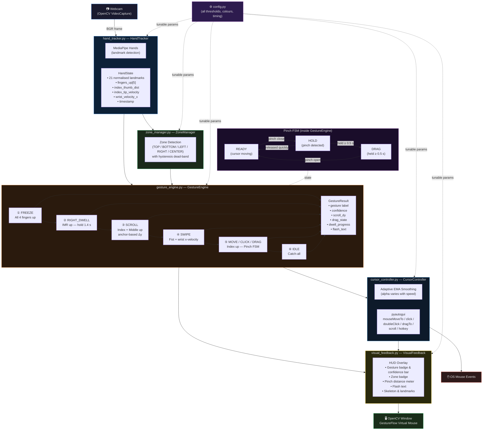

# 🖐️ GestureFlow Virtual Mouse

**Control your computer with just your hand — no physical mouse required.**

GestureFlow is a real-time, vision-based virtual mouse system that uses a standard webcam and MediaPipe hand tracking to translate hand gestures into mouse actions. It supports 8 distinct gestures including cursor movement, left/right click, double-click, drag & drop, scrolling, palm freeze, and swipe navigation.

---

## ✨ Features

| Gesture | Hand Pose | Action |
|---|---|---|
| **Move** | ☝️ Index finger up | Moves the cursor |
| **Left Click** | 🤏 Pinch & release (quick) | Single left click |
| **Double Click** | 🤏🤏 Pinch twice rapidly | Double left click |
| **Drag & Drop** | 🤏 Hold pinch ≥ 0.5 s | Drag; release to drop |
| **Right Click** | 🤘 Index + Middle + Ring up, hold 1.4 s | Right click (dwell) |
| **Scroll Up/Down** | ✌️ Index + Middle up | Scroll in the direction of movement |
| **Palm Freeze** | 🖐️ All 4 fingers up | Freezes cursor in place |
| **Swipe Forward/Back** | ✊ Fist + wrist flick | Browser forward / back navigation |

### Additional Highlights
- **Adaptive EMA cursor smoothing** — dynamically adjusts based on hand speed for both precision and responsiveness
- **Spatial interaction zones** — divides the camera frame into regions (TOP, BOTTOM, LEFT, RIGHT, CENTER) for contextual gesture handling
- **Real-time HUD overlay** — live display of gesture label, confidence bar, zone badge, pinch distance, and action flash
- **Pinch hysteresis FSM** — prevents click/drag flickering at threshold boundaries
- **Configurable** — all thresholds, sensitivities, and visual options live in a single `config.py`

---

## 🗂️ Project Structure

```
cv_proj/
├── main.py               # Entry point — orchestrates the pipeline
├── hand_tracker.py       # MediaPipe Hands wrapper → HandState dataclass
├── gesture_engine.py     # Stateful gesture recognition (8-gesture set)
├── cursor_controller.py  # Maps gestures to mouse actions (pyautogui)
├── zone_manager.py       # Spatial zone detection with hysteresis
├── visual_feedback.py    # HUD / overlay rendering on the OpenCV frame
├── config.py             # All tunable parameters in one place
└── requirements.txt      # Python dependencies
```

### Module Overview

- **`main.py`** — Frame-by-frame pipeline: capture → track → detect zone → recognise gesture → dispatch mouse action → render HUD.
- **`hand_tracker.py`** — Wraps `mediapipe.solutions.hands`, outputs a `HandState` containing normalised landmarks, finger extension flags, pinch distances, tip velocity, and wrist velocity.
- **`gesture_engine.py`** — Priority-ordered state machine evaluating gestures each frame. Maintains FSM state for pinch/drag, dwell timers for right-click, scroll anchors, and swipe cooldowns.
- **`cursor_controller.py`** — Consumes `GestureResult` and drives `pyautogui` mouse events with adaptive EMA smoothing.
- **`zone_manager.py`** — Divides normalised camera space into 5 zones using configurable thresholds and hysteresis dead-bands.
- **`visual_feedback.py`** — Renders the skeleton overlay, gesture badge, confidence bar, zone badge, pinch meter, and flash text onto the live frame.
- **`config.py`** — Central configuration: camera settings, zone thresholds, smoothing coefficients, gesture timing, colours, and more.

---

## 🛠️ Requirements

- Python **3.9 – 3.11** (recommended)
- A working **webcam** (default index `0`)
- Windows (tested); Linux/macOS may need minor `pyautogui` adjustments

### Python Dependencies

```
mediapipe>=0.10.0
opencv-python>=4.8.0
pyautogui>=0.9.54
numpy>=1.24.0
screeninfo>=0.8.1
protobuf==3.20.3
```

> **Note:** `protobuf==3.20.3` is pinned to avoid compatibility issues with older mediapipe builds.

---

## 🚀 Installation & Setup

### 1. Clone the repository

```bash
git clone https://github.com/your-username/cv_proj.git
cd cv_proj
```

### 2. Create a virtual environment (recommended)

```bash
python -m venv venv

# Windows
venv\Scripts\activate

# macOS / Linux
source venv/bin/activate
```

### 3. Install dependencies

```bash
pip install -r requirements.txt
```

### 4. Run the application

```bash
python main.py
```

Press **`Q`** or **`ESC`** to quit.

---

## ⚙️ Configuration

All parameters are in [`config.py`](config.py). Key settings:

| Parameter | Default | Description |
|---|---|---|
| `CAMERA_INDEX` | `0` | Webcam index |
| `FRAME_WIDTH / HEIGHT` | `1280 × 720` | Capture resolution |
| `SMOOTH_ALPHA_MIN` | `0.35` | Max smoothing (slow hand) |
| `SMOOTH_ALPHA_MAX` | `0.80` | Min smoothing (fast hand) |
| `PINCH_DISTANCE_THRESHOLD` | `0.065` | Normalised pinch threshold |
| `DRAG_HOLD_S` | `0.50 s` | Hold duration before drag starts |
| `RCLICK_HOLD_S` | `1.40 s` | Hold duration for right-click dwell |
| `SCROLL_SENSITIVITY` | `5` | Scroll units per gesture tick |
| `DOUBLE_CLICK_WINDOW_MS` | `600 ms` | Time window for double-click |
| `SWIPE_VEL` | `0.018` | Wrist velocity threshold for swipe |
| `TOP_ZONE_THRESH` | `0.25` | Top 25% of frame = TOP zone |

---

## 🏗️ Architecture Diagram


<!-- Mermaid source (for editors that support it)

-->
---

## 🧠 How It Works

**Frame-by-frame pipeline:**

```
Webcam Frame
     │
     ▼
HandTracker (MediaPipe)
     │  HandState (landmarks, fingers_up, distances, velocity)
     ▼
ZoneManager
     │  Zone (TOP / BOTTOM / LEFT / RIGHT / CENTER)
     ▼
GestureEngine
     │  GestureResult (gesture label, confidence, scroll_dy, drag_state …)
     ▼
CursorController  ──►  pyautogui (mouse move / click / scroll / drag)
     │
     ▼
VisualFeedback  ──►  OpenCV window (skeleton + HUD overlay)
```

**Gesture priority order (per frame):**
1. FREEZE — all 4 fingers open
2. RIGHT_DWELL — index + middle + ring up, dwell timer
3. SCROLL — index + middle up, anchor-based delta
4. SWIPE — closed fist + wrist x-velocity
5. MOVE / CLICK / DRAG — index up, pinch FSM
6. IDLE — catch-all

---

## 🐛 Troubleshooting

| Problem | Solution |
|---|---|
| `AttributeError` on mediapipe init | Ensure `protobuf==3.20.3` is installed exactly as pinned |
| Camera not opening | Check `CAMERA_INDEX` in `config.py`; try index `1` or `2` |
| Cursor too jittery | Increase `SMOOTH_ALPHA_MIN` closer to `0.5` |
| Cursor too sluggish | Decrease `SMOOTH_ALPHA_MIN` or increase `SMOOTH_ALPHA_MAX` |
| Scroll not triggering | Move finger more decisively; reduce `SCROLL_DY_MIN` |
| Drag fires too easily | Increase `DRAG_HOLD_S` (e.g., `0.8`) |
| Right-click too slow | Decrease `RCLICK_HOLD_S` (e.g., `1.0`) |

---

## 📜 License

This project is intended for educational and research purposes.

---

## 🙏 Acknowledgements

- [MediaPipe](https://mediapipe.dev/) by Google — hand landmark detection
- [OpenCV](https://opencv.org/) — real-time video capture and rendering
- [PyAutoGUI](https://pyautogui.readthedocs.io/) — cross-platform mouse control
